# Обучение Stable diffusion 1.5 методом Dreambooth

Необходимо дообучить модель Stable Diffusion на генерацию изображений конеретного человека. Также необходимо обучить модель LoRA и провести эксперименты по подбору параметра --rank. Обученные модели нужно объединить в один конвеер с одной из вариаций ControlNet и получить предсказания.    

# Датасет

Датасет из 18 изображений актрисы Эммы Уотсон 512х512 (./imgs)  

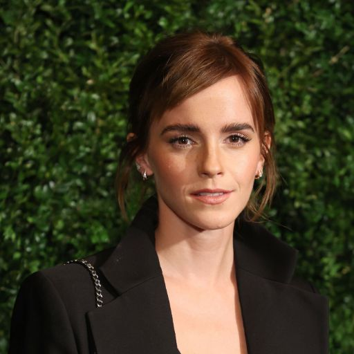
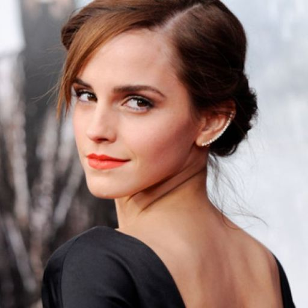
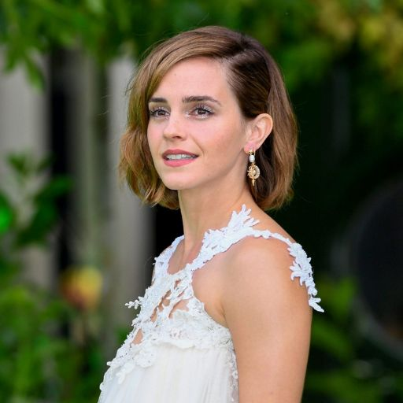

# Эксперименты

## Обучение Unet
loss = 0.0463  
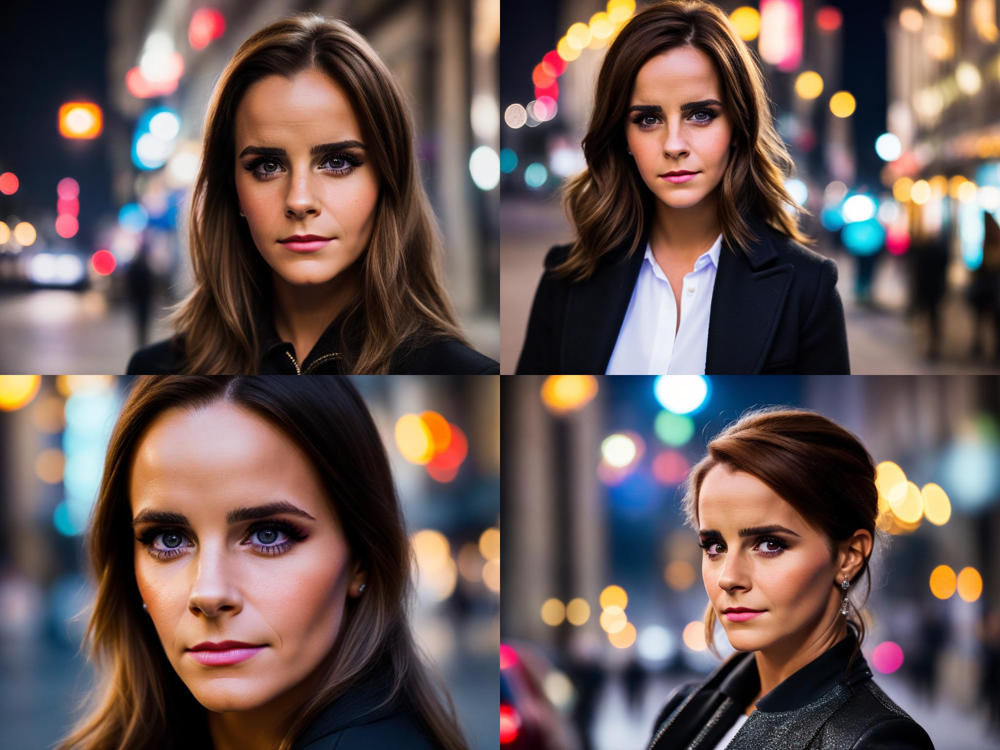
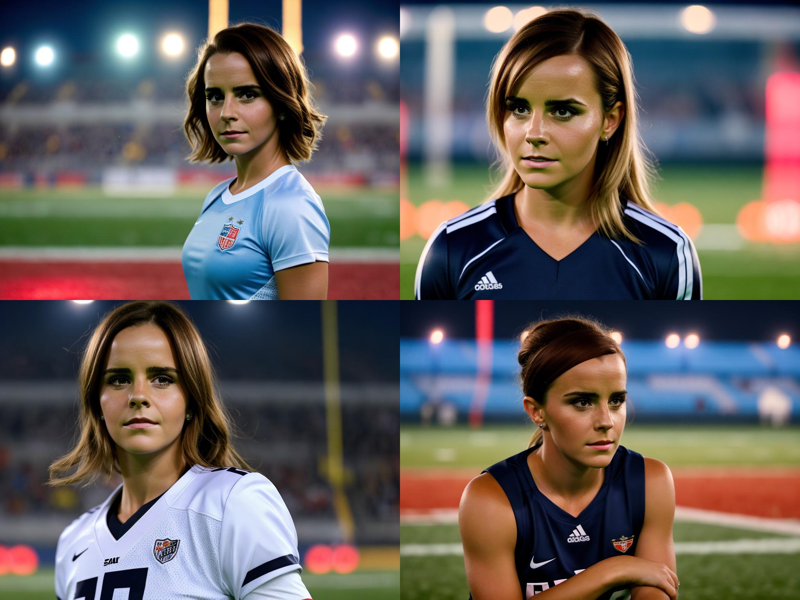

## Обучение LoRA
### Rank 32
loss = 0.785  
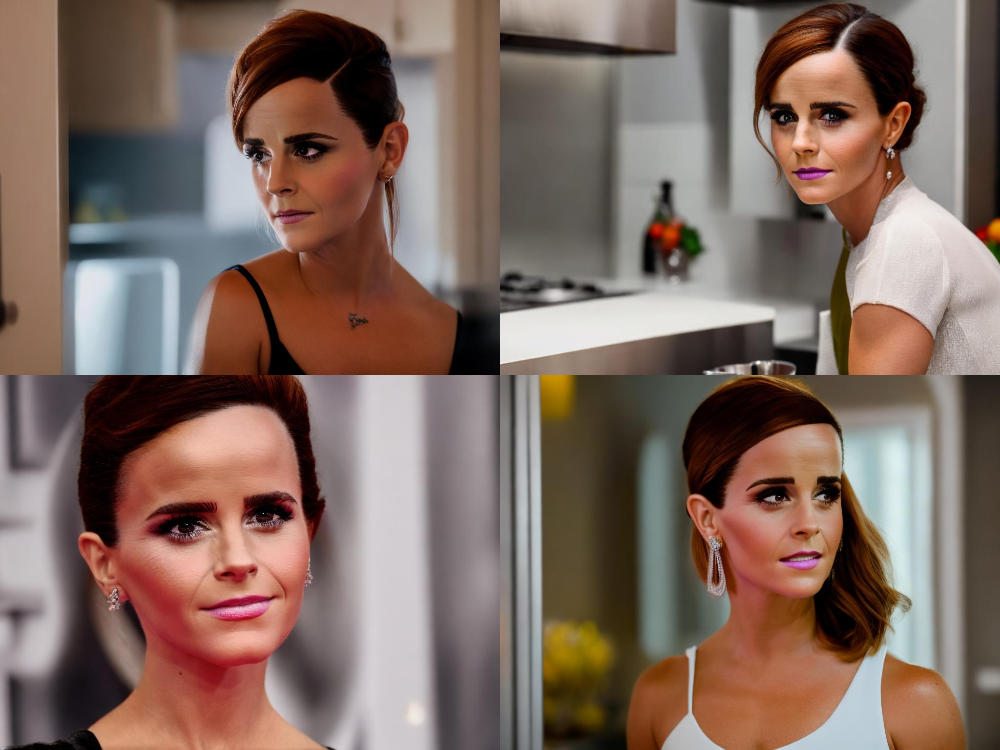

### Rank 64
loss = 0.0707  
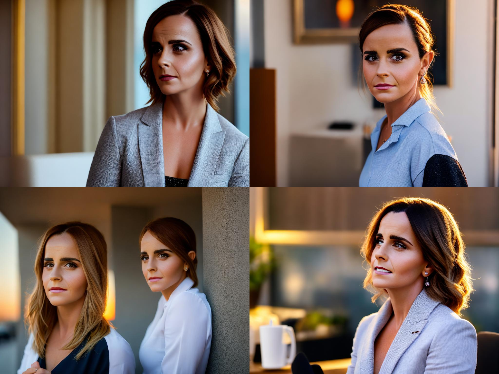
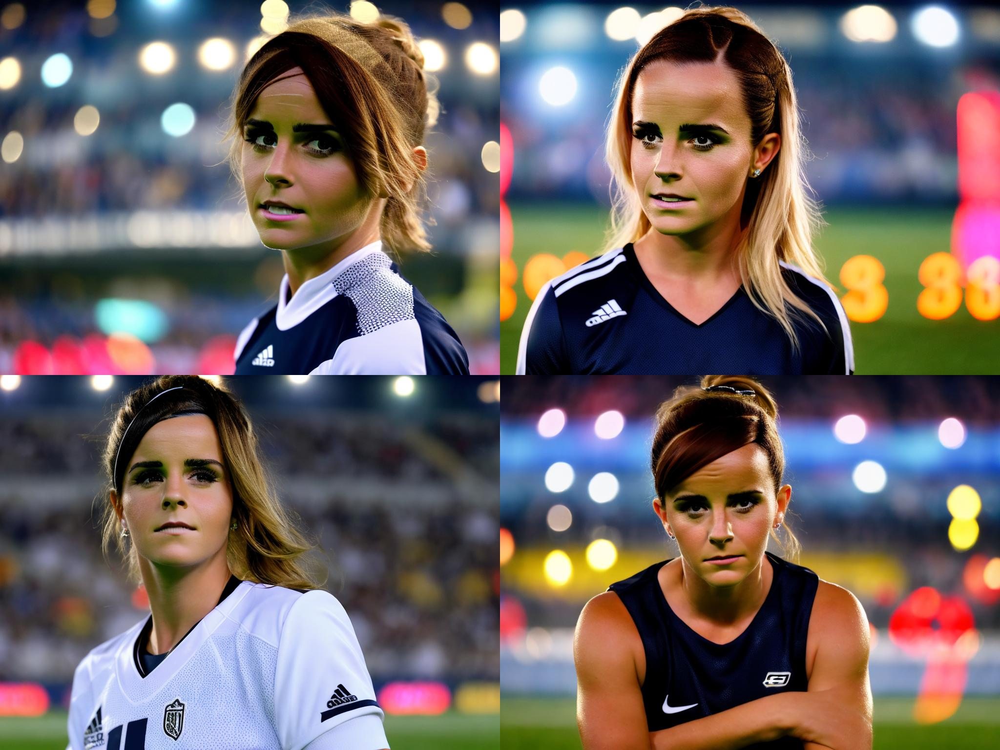

### Rank 128
loss = 0.422  
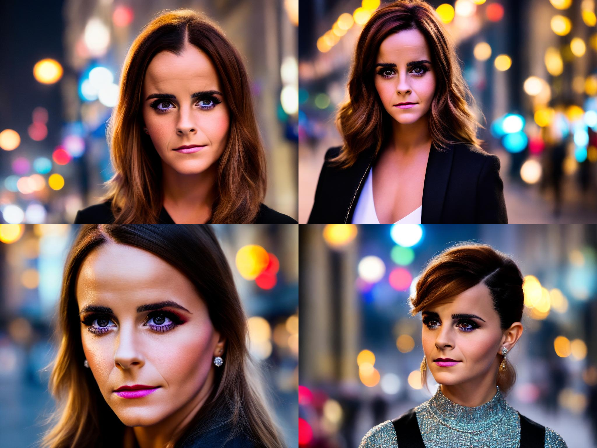

## ControlNet
### Unet
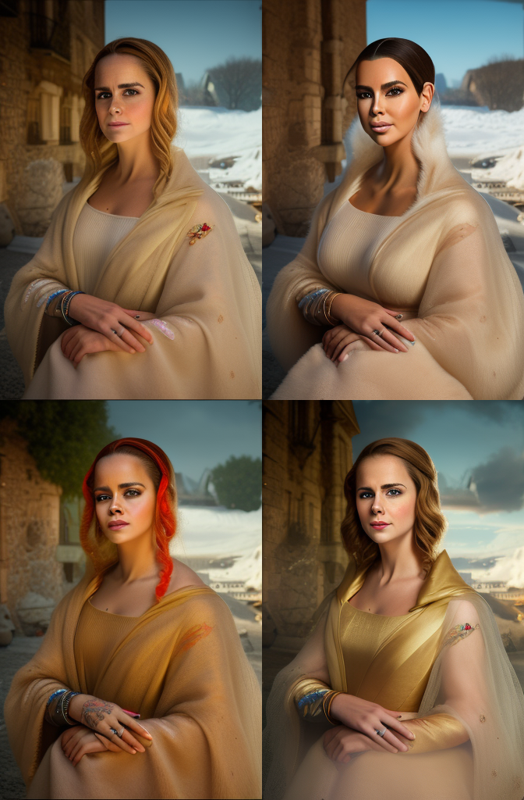

### LoRA r32
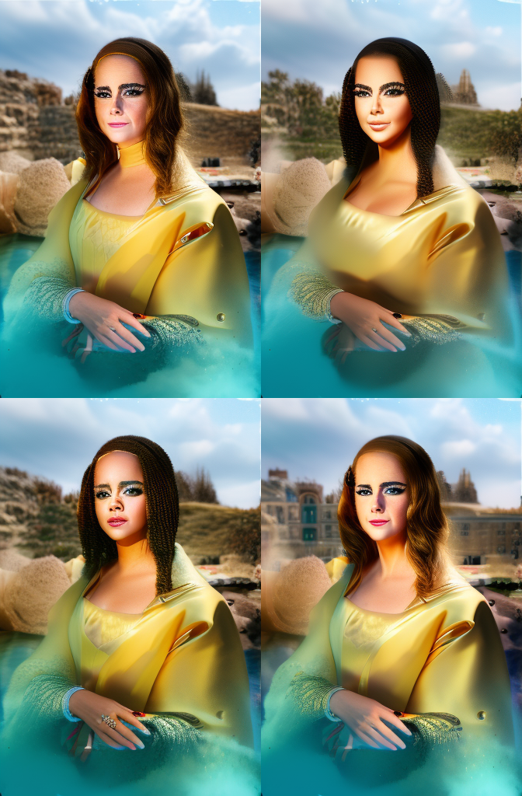

# Сравнение Unet и LoRA 
Лучшую модель LoRA (r64) я отобрал по значению функции потерь.  

## Football

## Forest
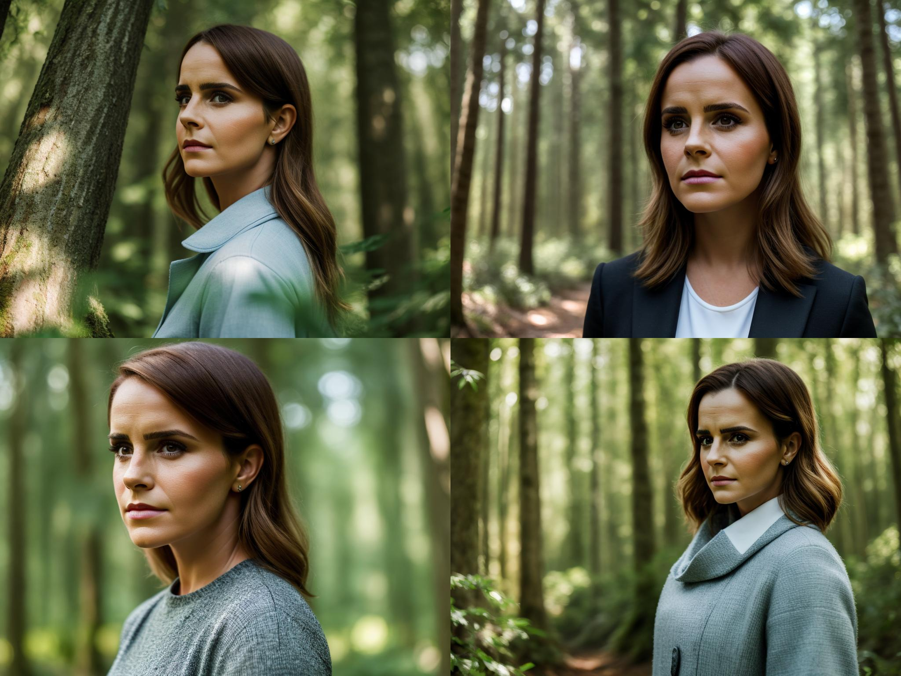
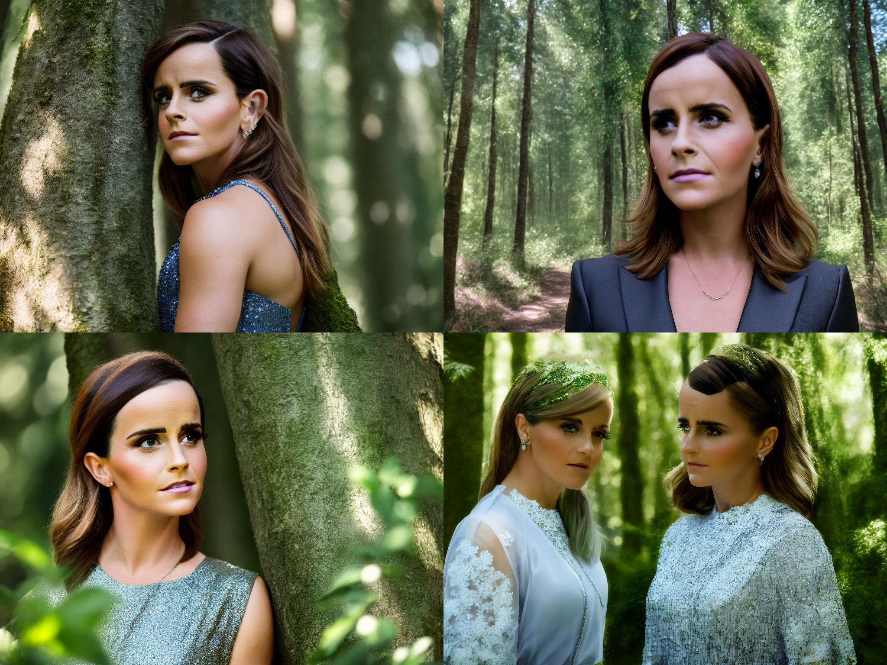

## Kitchen
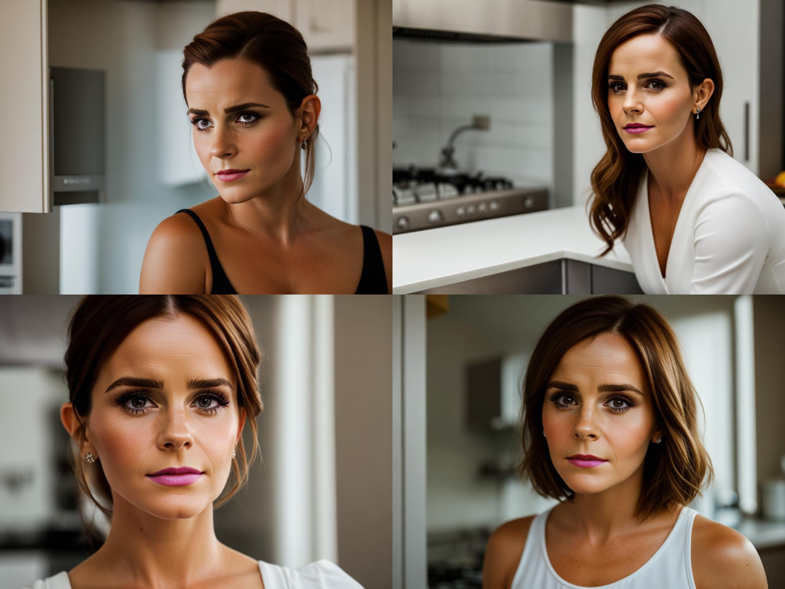

## Office
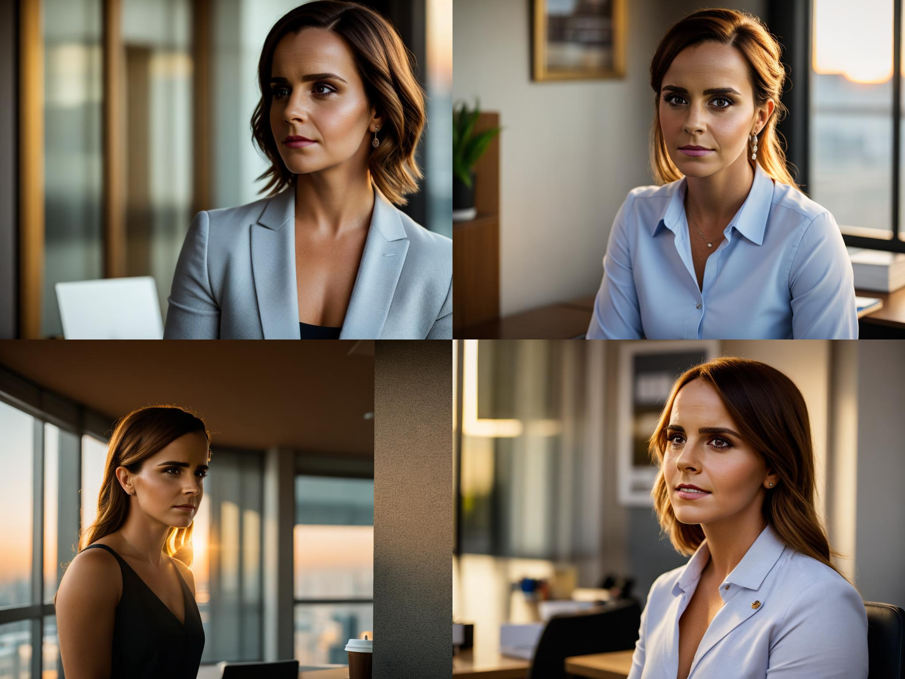

## Street

# Выводы
По значению функции потерь SD1.5 и LoRA r64 очень близки, и общее качество генерации у них на высоте, но по-моему мнению изображения сгенерированные с помощью LoRA получаются слишком яркими.  
По поводу ControlNet, я выбрал вариацию с нахождением границ референса. Позы получились очень похожими, но общее качество сгенерированных изображений ощутимо снизилось.

# Навигация
[Блокнот](/SD_1_5.ipynb) с процессом обучения.    
[Папка](/report_images) с изображениями результатов  
Используемые библиотеки [файл](/requirements.txt)