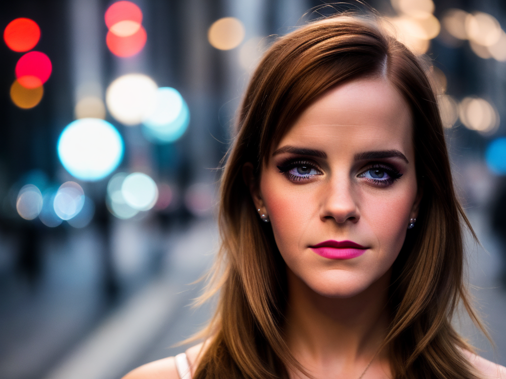
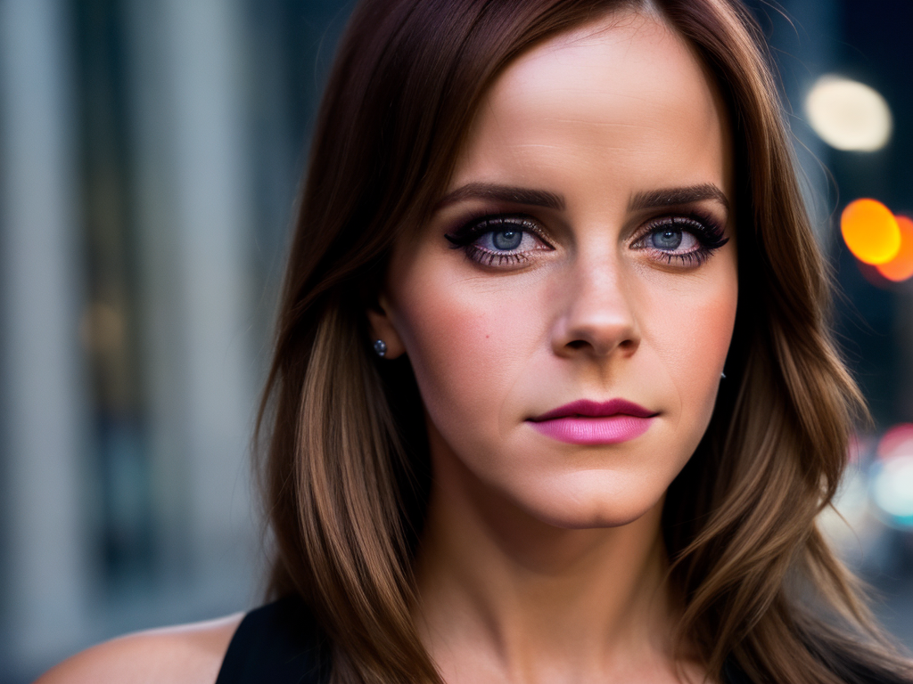

# Обучение Stable diffusion 1.5 методом Dreambooth
Обучить Unet методом Dreambooth для генерайции изображений конкретного человека.  
# Датасет
Датасет из 18 изображений актрисы Эммы Уотсон 512х512 (./imgs)  

# Результаты
[Ссылка](https://drive.google.com/drive/folders/1YFaM6f5_7ISmoMuVGShjaYwNcraM-te7?usp=drive_link) на папку с файлами модели   
## Пример генерации

# Навигация
[Блокнот](/Unet_train.ipynb) с процессом обучения.    
Используемые библиотеки [файл](/requirements.txt)